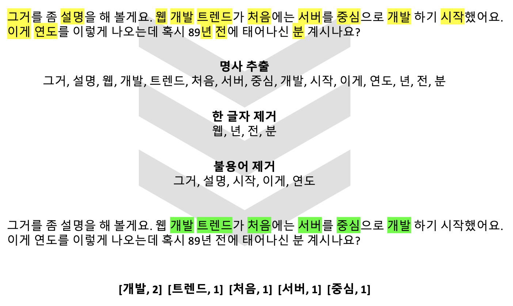
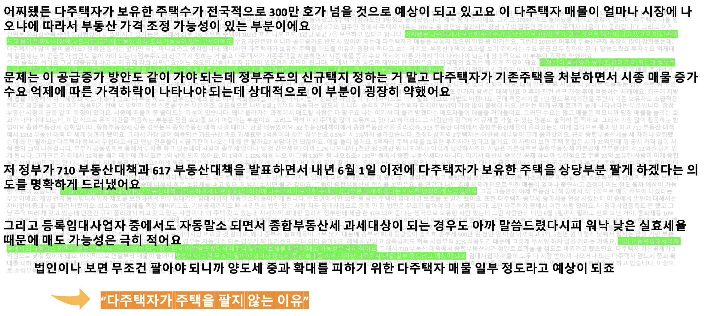

# 자연어 처리
와플노트 강의 종료 시 강의 전체에 대해서 분석을 실시한다. 
통계적 방법을 기반으로 핵심 키워드를 추출하고 키워드를 기반으로 문장별로 점수를 매겨 핵심 문장을 추출한다.

## 기능
### 1. 핵심 키워드 추출

키워드를 추출하기 위해서는 입력된 문자열을 형태소 분석을 통해 명사를 추출한다. 
형태소 분석은 토크나이저(Tokenizer)를 이용하며 본 프로젝트에서는 Mecab 토크나이저를 이용하였다. 
토크나이저를 통해 추출된 명사들 중에서 불용어(Stopword)에 해당하는 단어들이 있다. 
‘누구’, ‘이건’ 등 키워드 추출에 필요 없는 불용어들이 존재하며, 이미 정의되어있는 한국어 불용어를 이용할 수 있다. 
하지만 여전히 걸러지지 않는 불용어들에 대해서 직접 여러 텍스트들에 공통적으로 등장하는 단어를 불용어로 정의하여 따로 불용어 리스트를 추가적으로 만들었으며, 
이후에 계속된 테스트를 통해 발견된 불용어들은 직접 추가할 수 있도록 구현하였다.
따라서, 입력된 문자열에 대해서 명사를 추출하고 불용어를 제거한 후에 빈도수를 파악하여 높은 순서대로 키워드 리스트를 반환한다.

### 2. 핵심 문장 추출

파이썬 라이브러리 중 핵심 문장 추출 라이브러리 KR-WordRank를 활용하여 기능을 구현하였다. 
위와 같이 불용어를 정의한 후에 추출된 키워드에 대해서 순위가 높은 순으로 점수를 매긴다. 
키워드 별로 매겨진 점수는 높을수록 해당 단어가 포함된 문장이 중요도가 높아진다. 
입력으로 주어진 문장의 벡터와 키워드 벡터의 코싸인 유사도를 계산하여 문장의 중요도가 결정된다. 
중요도가 높은 순으로 문장 5개를 추출하여 반환한다.

## python version 
3.6

## References
- Flask
- mecab
- krwordrank